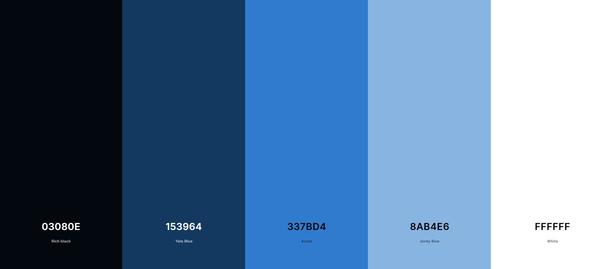

# edutechsmart-landingpage

## Re-creating EduTechSmart
This project is about re-creating the EduTechSmart website with different ideas and styling.

## Pitch
Our mission: make EduTechSmart’s landing page feel like 2025, not 2012. Clean design, mobile-first, and dark mode—because nobody likes being blinded at midnight.

## Design 

- Minimalist Layout – Focus on clarity and readability with plenty of whitespace.

- Mobile-First Approach – Designed for small screens first, then scaled up for tablets and desktops.

- Dark Mode Friendly – Built-in dark mode toggle for modern usability and reduced eye strain.

- Consistent Color Palette – Chosen to reflect professionalism while staying fresh and modern.

- Typography Hierarchy – Clean, modern fonts with clear headings and body text for easy scanning.

- Interactive Elements – Subtle hover effects, animations, and transitions to improve engagement.

- Accessibility – High-contrast text, keyboard navigation, and semantic HTML for inclusivity.

- Grid-Based Layout – Sections structured with CSS Grid/Flexbox for responsiveness and alignment.

- Reusable Components – Buttons, cards, and navbars designed for consistency across the site.

- Modern Hero Section – Bold headline, clear call-to-action button, and responsive background image/video.

## Backlog

### Backlog will constantly change and be updated.
| Feature | Description | Priority | Milestone | Status |
| ------- | ----------- | -------- | --------- | ------ |
| Readme | Project Planning | High | MVP | In progress |
| Navigations Menu | Menu with links | High | MVP | In progress |
| Testimonials | Testimonials from clients | Enhancement/low | UI Improvements | Code review |
| Footer | Footer with contact information | High | MVP | In progress |
| Hero section | Introduction to content | High | MVP | In progress |
| Info Section | Information about services | High | MVP | Done |
| Dark Mode | Button for darkmode option | Low  | UI Improvements | On hold |
| Glas styling | Glas-looking feature | Low | UI Improvements | On hold |
| SEO & Accessibility | Search optimization | Enhancement/low | MVP | On hold |
| Video Section | Section with videos | Moderate | UI Improvements | Done |
| Swedish Translation | Site translation | Moderate | UI Improvements | Done |
| Search Bar | Search function | Low | UI Improvements | In Progress |

## Color Palette

## Technologies
- HTML5
- CSS3
- JavaScript

## Collaborators
- https://github.com/meskilsson
- https://github.com/Benjameabi
- https://github.com/bjorkmanemelie
- https://github.com/JohannesFolkesson

## Installation

1. Fork this repository
2. Clone the forked repository
3. Add your contributions
4. Commit and push
5. Wait for pull request to be merged

